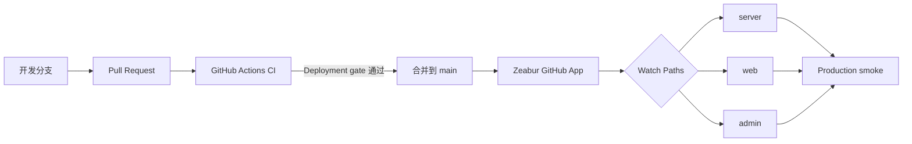

# Royal Flush 部署到 Zeabur

本文档对应当前的前后端分离架构，并从 Zeabur 的“构建计划预览”界面开始。最终在同一个 Zeabur Project 中运行五个服务：

| 服务名       | 来源                        | 是否公开 | 作用                            |
| ------------ | --------------------------- | -------- | ------------------------------- |
| `postgresql` | Zeabur 官方 PostgreSQL 模板 | 否       | 权威牌局、积分、房间和审计数据  |
| `redis`      | Zeabur 官方 Redis 模板      | 否       | 房间租约与单实例所有权          |
| `server`     | 本仓库 `Dockerfile.server`  | 否       | Go REST、WebSocket 和游戏状态机 |
| `web`        | 本仓库 `Dockerfile.web`     | 是       | 玩家端与 `/api/` 反向代理       |
| `admin`      | 本仓库 `Dockerfile.admin`   | 是       | 运营端与 `/api/` 反向代理       |

Zeabur 当前不支持直接从 Docker Compose YAML 部署。仓库根目录的 `compose.yaml` 只用于本地完整栈，不能作为 Zeabur 的部署入口。

## GitHub CI/CD 工作流

正式部署使用 Zeabur 官方 GitHub App，不使用本地项目上传，也不在 GitHub Actions 中保存 Zeabur API Key。



[`.github/workflows/ci.yml`](.github/workflows/ci.yml) 会执行 Go 测试与静态检查、Node 测试与构建、契约漂移检查、Playwright 流程、实时容量烟测，并真实构建三个生产 Dockerfile。所有任务最终汇总为一个名为 `Deployment gate` 的检查；Playwright 的 HTML 报告、截图、视频与 trace 会作为 7 天诊断产物上传。工作流引用的第三方 Action 固定到完整 commit SHA，降低可变标签带来的供应链风险。

在 GitHub 仓库的 **Settings → Rules → Rulesets** 中为 `main` 创建规则：

1. 要求通过 Pull Request 才能合并。
2. 要求分支在合并前保持最新。
3. 将 `Deployment gate` 设置为必需状态检查。
4. 禁止 force push 和删除 `main`。
5. 不允许管理员日常绕过该规则直接推送生产分支。

Zeabur 的 GitHub 自动部署由 `main` 的 push 触发，并不会等待同一次 push 上刚启动的 GitHub Actions。因此质量门禁必须发生在 Pull Request 合并之前：CI 失败时不能进入 `main`；成功合并后，进入 `main` 的提交已经通过完整检查，Zeabur 才开始部署。

Zeabur 回写成功的 `deployment_status` 后，[`.github/workflows/production-smoke.yml`](.github/workflows/production-smoke.yml) 会串联验证 `https://royal-flush.zeabur.app/`、`/api/v1/ready` 与 `https://royal-flush-admin.zeabur.app/`。同一时间只保留最新一次生产冒烟；它还会创建带正确玩家端 URL 的 GitHub `production` 环境记录，修正 Zeabur 原始状态中空 `environment_url` 导致的不可点击问题。该工作流也支持手动触发。

## 先处理当前构建预览

如果当前页面显示以下自动识别结果，不要点击紫色“部署”按钮：

```text
Framework: none
Package manager: npm
Install: npm install
Build: npm run build
Start: node index.js
```

仓库没有根目录 `index.js`，这套计划无法启动项目。关闭该预览，不再继续部署当前的 Local Project 服务。

本地上传是一次性源码快照，不能形成持续部署。先将当前本地提交推送到 `https://github.com/dcfjustok-afk/Royal-Flush`，再到 Zeabur 的 **Account Settings → Integrations** 关联 GitHub，并在 GitHub 中安装 Zeabur App。安装时只授予该仓库访问权限即可。

## 1. 创建 PostgreSQL

1. 回到当前 Zeabur Project 的服务列表。
2. 选择“添加服务”，从 Marketplace 添加官方 PostgreSQL 服务。
3. 等待状态变为运行中。
4. 不需要给 PostgreSQL 绑定公开域名或 TCP 公网端口。

官方模板会提供 `POSTGRES_CONNECTION_STRING`。Go 服务稍后通过 `${POSTGRES_CONNECTION_STRING}` 引用它，不要把数据库密码复制进仓库。

## 2. 创建 Redis

1. 再次选择“添加服务”，从 Marketplace 添加官方 Redis 服务。
2. 等待状态变为运行中。
3. 不需要给 Redis 绑定公开域名或 TCP 公网端口。

官方模板会提供 `REDIS_CONNECTION_STRING`。Go 服务稍后通过 `${REDIS_CONNECTION_STRING}` 引用它。

## 3. 部署私有 Go 服务

1. 选择“添加服务 → GitHub”，选择 `dcfjustok-afk/Royal-Flush` 仓库和 `main` 分支。
2. 将服务名设为小写的 `server`。这个名称会生成供其他服务使用的 `SERVER_HOST`。
3. 在服务变量中录入 [server.env.example](deploy/zeabur/server.env.example) 的内容。
4. 将 `ADMIN_ACCOUNT`、`ADMIN_PASSWORD` 设置为运营管理员凭据；两者只写入 Zeabur `server` 服务环境变量。
5. 不要手动设置 `PORT`。Zeabur 会注入监听端口，程序默认兼容 `8080`。
6. 确认构建计划使用 `Dockerfile.server` 后再部署。
7. 将健康检查路径设为 `/api/v1/ready`。
8. 不给 `server` 绑定公开域名。玩家端和运营端会通过 Zeabur 私有网络访问它。

`ZBPACK_DOCKERFILE_NAME` 的值必须写 `server`，不能写成 `Dockerfile.server`。

玩家账号已经使用手机号和密码，并把密码哈希、资料和会话保存在 PostgreSQL。正式服务应使用：

```dotenv
ENVIRONMENT=production
```

`development` 模式仍会为旧 OTP 接口返回固定验证码，只适合本地验收，不能用于公开环境。玩家端正式入口不再依赖短信验证码。

## 4. 部署玩家端

1. 再次选择“添加服务 → GitHub”，选择同一个仓库和 `main` 分支。
2. 将服务名设为小写的 `web`。
3. 在服务变量中录入 [web.env.example](deploy/zeabur/web.env.example) 的内容。
4. 确认构建计划使用 `Dockerfile.web` 后部署。
5. 将健康检查路径设为 `/`。
6. 在 Networking 中为 `web` 生成 Zeabur 域名或绑定自己的 HTTPS 域名。

关键变量是：

```dotenv
API_UPSTREAM=http://${SERVER_HOST}:8080
```

浏览器只访问 `web` 的公开域名。Nginx 会把 REST 和 WebSocket 请求转发到私有 `server`，因此不需要公开 API 域名，也不需要配置跨域来源。

## 5. 部署运营端

1. 第三次选择“添加服务 → GitHub”，选择同一个仓库和 `main` 分支。
2. 将服务名设为小写的 `admin`。
3. 在服务变量中录入 [admin.env.example](deploy/zeabur/admin.env.example) 的内容。
4. 确认构建计划使用 `Dockerfile.admin` 后部署。
5. 将健康检查路径设为 `/`。
6. 为 `admin` 绑定与玩家端不同的 HTTPS 域名。

运营端首次打开时要求管理员账号和密码登录。账号与密码只通过 `ADMIN_ACCOUNT`、`ADMIN_PASSWORD` 环境变量注入服务端，不写入前端代码、仓库或日志；玩家端使用自己的手机号与密码注册登录。玩家端和运营端域名不同，所以两边需要分别登录一次。

## 6. 配置按路径重部署

三个 GitHub 服务创建完成后，分别进入 **Settings → Watch Paths**。Zeabur 默认值 `*` 会在仓库任意文件变化时重建服务，需要替换为仓库提供的精确路径：

| Zeabur 服务 | 复制到 Watch Paths 的文件                          |
| ----------- | -------------------------------------------------- |
| `server`    | [server.txt](deploy/zeabur/watch-paths/server.txt) |
| `web`       | [web.txt](deploy/zeabur/watch-paths/web.txt)       |
| `admin`     | [admin.txt](deploy/zeabur/watch-paths/admin.txt)   |

Watch Paths 使用类似 `.gitignore` 的格式，但含义相反：匹配表示触发部署。配置后的典型行为如下：

| Git 变更                                     | 自动重新部署     |
| -------------------------------------------- | ---------------- |
| `services/server/**`                         | 仅 `server`      |
| `apps/web/**`                                | 仅 `web`         |
| `apps/admin/**`                              | 仅 `admin`       |
| `packages/contracts/**`、`package-lock.json` | `web` 和 `admin` |
| `.dockerignore`                              | 三个源码服务     |
| `README.md`、`ZEABUR.md`、`.github/**`       | 不部署源码服务   |

PostgreSQL 和 Redis 是独立数据服务，不关联 Git 仓库，也不会因为代码 push 被重建或清空。

## 7. 配置语音

首次部署可以把三个 `LIVEKIT_*` 变量留空。此时玩家端会自动使用浏览器 WebRTC 直连语音，不影响房间、积分和实时牌局。

需要语音时，建议创建 LiveKit Cloud 项目，并在 `server` 服务中设置：

```dotenv
LIVEKIT_URL=wss://你的-livekit-cloud-地址
LIVEKIT_API_KEY=你的-api-key
LIVEKIT_API_SECRET=你的-api-secret
```

不要把真实密钥写进 Git。自托管 LiveKit 需要额外处理 WebSocket 信令、RTC TCP/UDP、外部 IP、TURN 和媒体端口范围，不适合作为这次 Zeabur 首发部署的一部分。

浏览器降级至少需要 STUN；为覆盖公司网、校园网和对称 NAT，建议使用可信 TURN 服务：

```dotenv
VOICE_ICE_URLS=stun:stun.l.google.com:19302,turns:你的-turn-地址:5349
VOICE_TURN_USERNAME=你的-turn-用户名
VOICE_TURN_CREDENTIAL=你的-turn-密码
```

## 8. 验收顺序

按以下顺序验证，出现问题时更容易定位到具体服务：

1. `server` 日志显示 PostgreSQL migration 成功，并开始监听 Zeabur 注入的端口。
2. `https://玩家域名/api/v1/ready` 返回 `{"status":"ready"...}`。
3. 玩家域名能打开账号页面，完成手机号和密码注册、退出与重新登录，刷新后登录状态仍保留。
4. 创建房间后，第二个浏览器会话可以加入；行动和断线重连正常。
5. 运营域名能使用 `ADMIN_ACCOUNT`、`ADMIN_PASSWORD` 登录，并看到用户、房间、举报和审计数据。
6. 执行全站积分重置前填写原因并完成二次确认；活跃牌局不应中断。
7. 用两个已入座浏览器验证麦克风授权、设备切换、房主禁言和断线重连；再配置 LiveKit Cloud 验证自动优先使用 LiveKit。
8. 合并一个只修改 `apps/web` 的测试 Pull Request，确认 CI 的 `Deployment gate` 通过后只有 `web` 产生新部署。
9. 在 Zeabur 部署记录中确认 commit SHA 与 GitHub `main` 最新提交一致。
10. 在 GitHub Actions 中确认 `Production smoke / Verify production` 通过，并可从 `production` 环境直接打开玩家端。

## 变量检查表

| 服务     | 必填变量                                                                                            | 可选变量                                               |
| -------- | --------------------------------------------------------------------------------------------------- | ------------------------------------------------------ |
| `server` | `ZBPACK_DOCKERFILE_NAME`、`ENVIRONMENT`、`DATABASE_URL`、`REDIS_URL`、`INSTANCE_ID`、`ADMIN_ACCOUNT`、`ADMIN_PASSWORD` | `LIVEKIT_*`、`VOICE_ICE_URLS`、`VOICE_TURN_USERNAME`、`VOICE_TURN_CREDENTIAL` |
| `web`    | `ZBPACK_DOCKERFILE_NAME`、`API_UPSTREAM`                                                            | 无                                                     |
| `admin`  | `ZBPACK_DOCKERFILE_NAME`、`API_UPSTREAM`                                                            | 无                                                     |

不要提交真实手机号、数据库连接串、Redis 密码、LiveKit 密钥或正式域名。Zeabur 的 `${VARIABLE}` 引用应保留在服务变量中，让平台在运行时解析。

## 上线前仍需完成

- 若重新启用 OTP 登录，需先接入真实短信服务商并增加防滥用策略；公开环境必须使用 `ENVIRONMENT=production`。
- 为密码注册和登录增加跨实例共享的边缘限流/WAF 策略。
- 为 WebRTC 降级配置生产 TURN，或配置 LiveKit Cloud，覆盖严格 NAT 网络。
- 完成 ICP、隐私政策、用户协议、手机号和语音个人信息处理、未成年人策略及非博彩边界专项合规审查。
- 配置日志、备份、告警和 PostgreSQL 恢复演练，再开放长期使用。

## Zeabur 官方参考

- [使用 Dockerfile 部署](https://zeabur.com/docs/en-US/deploy/methods/dockerfile)
- [GitHub 集成与自动部署](https://zeabur.com/docs/en-US/deploy/methods/github-integration)
- [Watch Paths](https://zeabur.com/docs/en-US/deploy/config/watch-paths)
- [创建服务](https://zeabur.com/docs/en-US/deploy/create/create-service)
- [环境变量与服务变量引用](https://zeabur.com/docs/en-US/deploy/config/environment-variables)
- [私有网络](https://zeabur.com/docs/en-US/deploy/networking/private-networking)
- [Monorepo 根目录配置](https://zeabur.com/docs/en-US/deploy/config/root-directory)
- [官方 PostgreSQL 模板](https://zeabur.com/templates/B20CX0)
- [官方 Redis 模板](https://zeabur.com/templates/KQZHXT)
